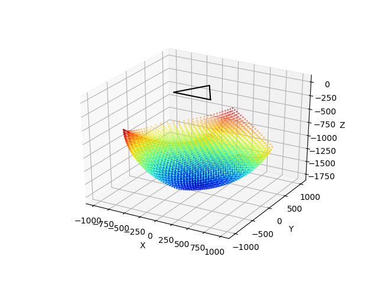
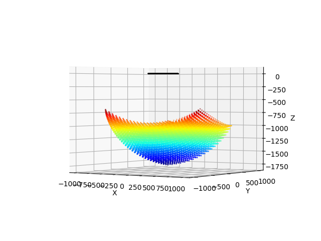
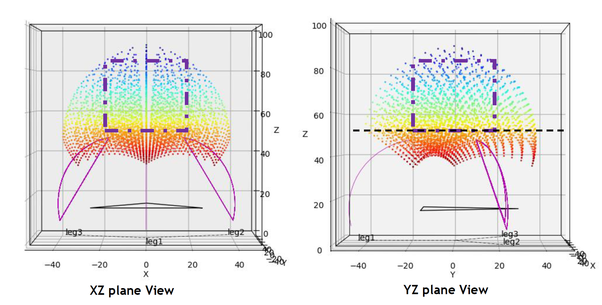
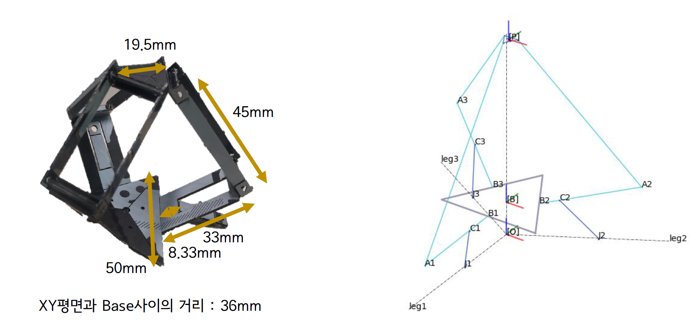
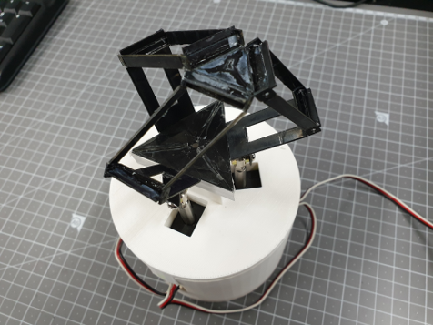
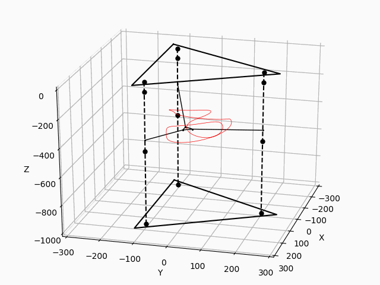

# Deltarobot_Kinematics

<p align="center">


</p>

## Environment
- Python 3.7
- numpy 1.16.1
- matplotlib 3.1.0
- (To save as gif) [imagemagick](https://imagemagick.org/index.php)

## Delta robot parameters
[Forward Kinematics of Delta Robot](./assets/Forward%20Kinematics%20of%20Delta%20Robot.pdf)

```python
Aleg = np.array([524, 524, 524], dtype='float')         #Set active link length
Pleg = np.array([1244, 1244, 1244], dtype='float')      #Set passive link length

sideB = 567                         #Set base length
sideP = 76                          #Set platform length
```

`Aleg` : 베이스와 연결되어 모터가 움직이는 다리의 길이(The length of the leg that is connected to the base and moves by actuator.)

`Pleg` : 플랫폼과 연결되어 `Aleg`에 의해 수동적으로 움직이는 다리의 길이(The length of the leg that is connected to the platform and moves passively by `Aleg`.)

`sideB` : 삼각형 베이스의 한변의 길이(Length of one side of a triangle base)

`sideP` : 삼각형 플랫폼의 한변의 길이(Length of one side of a triangle platform)


## Contents
- Forward Kinematics
  - [Delta_Rev_FPK_Solution_MV.py](#delta_rev_fpk_solution_mvpy)
  - [Delta_Rev_FPK_Solution_MV_animation.py](#delta_rev_fpk_solution_mv_animationpy)
- Inverse Kinematics
  - [Delta_Rev_IPK_Solution_MV.py](#delta_rev_ipk_solution_mvpy)
  - [Delta_Rev_IPK_Solution_MV_animation](#delta_rev_ipk_solution_mv_animationpy)
- [Applications](#applications)
  - [Check workspace](#applications---check-workspace)
  - [Delta robot control](#applications---delta-robot-control)
  - [Primatic actuator based delta robot forward kinematics](#applications---primatic-actuator-based-delta-robot-forward-kinematics)
## Delta_Rev_FPK_Solution_MV.py
델타로봇의 FPK(Forward Position Kinematics). 지정된 각도를 여러개 입력하였을 때 델타 로봇 끝단의 위치를 출력하는 파일

FPK (Forward Position Kinematics) of Delta Robot. A file that outputs the position of the tip of the Delta robot when multiple specified angles are entered.

### Input
```python
#Set input angle in degree
deg_Aleg = np.deg2rad(np.array([[0, 10, -20.5, 47.5],
                                [0, 20, -20.5, -11.6],
                                [0, 30, -20.5, 21.4]]))
```
### Output
```
1th Input Degree : 0.00000000    0.00000000    0.00000000
Result Coordinate : <0.0000    0.0000    -1064.4517>

2th Input Degree : 10.00000000    20.00000000    30.00000000
Result Coordinate : <108.1354    -180.3484    -1243.5413>

3th Input Degree : -20.50000000    -20.50000000    -20.50000000
Result Coordinate : <0.0000    0.0000    -900.3195>

4th Input Degree : 47.50000000    -11.60000000    21.40000000
Result Coordinate : <300.4598    499.9385    -1099.8281>
```

<p align="center"></p>

### Delta_Rev_FPK_Solution_MV_animation.py
델타로봇의 FPK(Forward Position Kinematics). 지정된 각도를 여러개 입력하였을 때 움직임을 애니메이션으로 출력하는 파일

FPK (Forward Position Kinematics) of Delta Robot. A file that animates the movement when multiple specified angles are entered.

#### Input
```python
#Set input angle in degree
t = np.linspace(0, 2*pi, 200)
deg_Aleg = np.deg2rad(np.array([60*sin(t), 60*sin(2*t), 60*cos(3*t)], dtype='float'))
```

#### Output
```
1th Input Degree : 0.00000000    0.00000000    60.00000000
Result Coordinate : <619.5159    -357.6777    -1040.1298>

...

200th Input Degree : -0.00000000    -0.00000000    60.00000000
Result Coordinate : <619.5159    -357.6777    -1040.1298>
```
<p align="center"></p>


## Delta_Rev_IPK_Solution_MV.py
델타로봇의 IPK(Inverse Position Kinematics). 지정된 위치를 여러개 입력하였을 때 필요한 각도를 출력하는 파일

IPK (Inverse Position Kinematics) of Delta Robot. A file that outputs the required angle when multiple specified positions are entered.

### Input
```python
#Set input <x, y, z> coordinate
XYZcoor = np.array([[0, 108.14, 0, 300.46, 0],
                    [0, -180.35, 0, 499.94, 0],
                    [-1064.45, -1243.54, -900.32, -1099.83, -1762.22]], dtype='float')
```

### Output
```
1th Input Coordinate : <0.0000    0.0000    -1064.4500>
Result Angle : <-0.00    -0.00    -0.00>

2th Input Coordinate : <108.1400    -180.3500    -1243.5400>
Result Angle : <10.00    20.00    30.00>

3th Input Coordinate : <0.0000    0.0000    -900.3200>
Result Angle : <-20.50    -20.50    -20.50>

4th Input Coordinate : <300.4600    499.9400    -1099.8300>
Result Angle : <47.50    -11.60    21.40>

5th Input Coordinate : <0.0000    0.0000    -1762.2200>
Result Angle : <90.00    90.00    90.00>
```

## Delta_Rev_IPK_Solution_MV_animation.py

델타로봇의 IPK(Inverse Position Kinematics). 지정된 위치를 여러개 입력하였을 때 움직임을 애니메이션으로 출력하는 파일

IPK (Inverse Position Kinematics) of Delta Robot. A file that animates the movement when multiple specified positions are entered.

### Input
```python
t = np.linspace(0, 2*pi, 200)
XYZcoor = np.array([500*cos(t), 500*sin(t), -1000+200*sin(4*t)], dtype='float')
```

### Output
```
1th Input Coordinate : <500.0000    0.0000    -1000.0000>
Result Angle : <6.36    -23.26    33.49>

...

200th Input Coordinate : <500.0000    -0.0000    -1000.0000>
Result Angle : <6.36    -23.26    33.49>
```

<p align="center">


</p>

## Applications - Check workspace
File : [Delta_Rev_Workspace.py](./Delta_Rev_Workspace.py)

로봇의 각 링크의 길이에 따라 나타나는 작업영역의 적합성 판별에 사용 가능

Can be used to determine the workspace according to the length of each link of the robot.

### Input
```python
#Set input angle limit in degree
deg_min = -20
deg_max = 80
size = 20       # number of angle divisions
```

### Output
<p align="center">


</p>
<p align="center">

</p>

## Applications - Delta robot control

<p align="center">

</p>
<p align="center">


</p>


## Applications - Primatic actuator based delta robot forward kinematics

File : [Delta_Pris_FPK_Solution_MV_animation.py](./Delta_Pris_FPK_Solution_MV_animation.py)

<p align="center">

</p>


## References
- [The Delta Parallel Robot: Kinematics Solutions](https://people.ohio.edu/williams/html/PDF/DeltaKin.pdf)
- [Reliable computation of the points of intersection of spheres](https://journal.austms.org.au/ojs/index.php/ANZIAMJ/article/view/608/476)

(Files are available in *assets* directory)